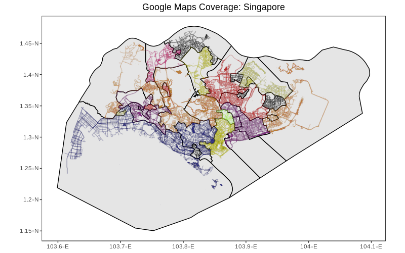

# Google StreetView Geographic Information System (GIS) stack
To help large-scale visual geo-localization research, we developed this tool to generate Google Street View coverage maps by leveraging on Geographic Information System (using GIS packages in R) and Google Static Street View API (using Python). This code has been tested with Singapore. This tool is strictly for academic/ research purposes only.

This tool helps to obtain Google StreetView metadata and not the actual panoramas. Google has strict regulations regarding the use of Google StreetView panoramas and details can be found [here](https://cloud.google.com/maps-platform/terms/#10-license-restrictions).


## Problem Statement

Google provides extensive street view panorama coverage in Singapore. To obtain accurate coverage details, we need to query the Google Static StreetView API for the presence of StreetView panorama at multiple geo-locations. A naive way of doing this would be to follow a brute force form of approach querying every possible latitude and longitude spaced at regular intervals to obtain the coverage. Since this is costly and inefficient, we have designed a pipeline to obtain coverage details much more efficiently with no API cost.


## Pipeline

### Geographic Information System (GIS)

The GIS stack performs the following operations to sample unique geo-locations at 1m interval throughout all the roads/ streets in Singapore using Open Street Maps API.

1. Create base map of Singapore (from shapefile).
2. Import any administrative unit/ geographic unit districts information as vector file. (We use KML format)
3. Create osm (Open street maps) query and retrieve osm data using osmdata library [[1]](#1). 
4. Do geometric operations to find the intersection with base map and perform union of all the resulting regions
5. Now sample points at 1m distance at regular intervals to create extracted_points.csv.


### Google Static StreetView (GSV) API

Now in this section, we will use the extracted points from the GIS stack to query the Google Static StreetView API meta-data service to check the presence of Google StreetView panorama image. In order to perform a query, we require specific spatial location parameters (Latitude/ Longitude or Plus codes). In the GIS stack, for every sampled point, we extract the corresponding latitude and longitude data.

Google associates every StreetView panorama using a unique id called pano_id. Using the metadata service, we extract all the required information to create the coverage statistics and maps. Every query will return the following details:

| Field             | Details                                                      |
| ----------------- | ------------------------------------------------------------ |
| lat/ lng          | latitude and longitude extracted from the GIS stack          |
| kml               | district/ administrative unit                                |
| ret_lat/  ret_lng | latitude and longitude returned by GSV metadata service. (In many occasions this may slightly differ from the query as Google returns the best match for the query) |
| pano_id           | Unique panorama id for the specific geo-location             |
| status            | The status of query returned by Google. (OK, ZERO_RESULTS, OVER_QUERY_LIMIT). If status=ZERO_RESULTS, pano_id is recorded as -1. If OVER_QUERY_LIMIT, we repeat the queries again. |

A sample retrieved record is shown below.

| lat              | lng              | kml  | ret_lat          | ret_lng          | pano_id                | status |
| ---------------- | ---------------- | ---- | ---------------- | ---------------- | ---------------------- | ------ |
| 1.36597564133697 | 103.890522755108 | 1    | 1.36598953663481 | 103.890562223944 | 1aZIE3M2YwiDkzIXdo1Q1Q | OK     |


## How to use the code?

The data directory contains the shapefile and electoral boundary file (https://data.gov.sg/dataset/electoral-boundary-2015) for Singapore. To use Google Static StreetView API, you need an API key with standard permissions. Place the API key and Secret key in a file called proj-env.json. i.e. : The file contents of proj-env.json should look similar to the following:

```json
{
    "API_KEY": "1fgd01ryttsadafs",
    "SECRET_KEY": "RfgWJHs12qht8Vrg89gzXs="
}
```

* The GIS code is written in R and requires `sp`, `sf`, `tidyverse`, `osmdata`, `data.table` and `pryr` R packages. 
* The GSV code is written in python and to install the dependencies, simply run `pip install -r src/gsv/requirements.txt` . 
* Use the ``src/gis/gis_stack.Rmd`` file to sample points at 1m interval using Open Street Maps library. These extracted points will be stored in a csv file. 
* In the next step, use these extracted points to query the Google Static StreetView meta-data service (This is a free service) to generate the coverage details using `src/gsv/engine-metadata.py` . 

Do note that Google limits API requests to 50 queries/ second (As of March 2020). More information regarding Google Static StreetView API can be found [here](https://developers.google.com/maps/documentation/streetview/overview). For further details, please refer to the code as it is clearly documented.


## Singapore GSV statistics

Using the GIS stack, we sample approximately 12.1 million geo-locations throughout Singapore where we finally obtain a 630,141 unique geo-locations in Singapore with Google StreetView images. We provide district-wise breakdown of the results in the following table. 

| District Name         | KML ID |  #Sampled points | #Unique geo-locations with GSV panorama |
| --------------------- | ------ | ---------------: | --------------------------------------: |
| Hougang               | 1      |            34018 |                                    2312 |
| Hong Kah North        | 2      |           182639 |                                    8322 |
| Holland - Bukit Timah | 3      |           660731 |                                   41148 |
| Jalan Besar           | 4      |           584320 |                                   47563 |
| Nes Soon              | 5      |           440244 |                                   22899 |
| Punggol East          | 6      |            37493 |                                    2561 |
| Pioneer               | 7      |            43545 |                                    2512 |
| Pasir Ris - Punggol   | 8      |           501844 |                                   35108 |
| Potong Pasir          | 9      |            96389 |                                    5920 |
| Radin Mas             | 10     |            99817 |                                    5186 |
| Sembawang             | 11     |           520941 |                                   27385 |
| Sengkang West         | 12     |            74359 |                                    4454 |
| Tampines              | 13     |           225548 |                                   15625 |
| Tanjong Pagar         | 14     |           760316 |                                   49636 |
| West Coast            | 15     |          2636885 |                                   83649 |
| Yuhua                 | 16     |            52267 |                                    2743 |
| Jurong                | 17     |           386803 |                                   23326 |
| Marine Parade         | 18     |           530209 |                                   35864 |
| MountBatten           | 19     |           206581 |                                   14664 |
| Macpherson            | 20     |            59285 |                                    3827 |
| Marsiling-Yew Tee     | 21     |           403383 |                                   19200 |
| Aljunied              | 22     |           517023 |                                   30437 |
| Ang Mo Kio            | 23     |           627258 |                                   35040 |
| Bukit Batok           | 24     |            43723 |                                    2798 |
| Bukit Panjang         | 25     |            41142 |                                    3428 |
| Bishan-Toa Payoh      | 26     |           491392 |                                   34534 |
| Chua Chu Kang         | 27     |           875273 |                                   28783 |
| East Coast            | 28     |           959480 |                                   39236 |
| Fengshan              | 29     |            34970 |                                    1981 |
|                       |        | **12, 127, 878** |                            **630, 141** |


## Singapore Coverage Map

The following map shows the Google StreetView Coverage in Singapore. District-wise color coding is performed.




## Acknowledgements

This work was done by Keshigeyan Chandrasegaran (Information Systems Design and Technology) during his time at [Temasek Laboratories, Singapore University of Technology and Design](https://temasek-labs.sutd.edu.sg/). Please contact him at keshigeyan@sutd.edu.sg regarding any further questions. 


## Data Access

We do not publish the final retrieved Google Street View meta-data since it contains sensitive information. If you require these data for your research, please contact Keshigeyan (keshigeyan@sutd.edu.sg) / Dr. Tran Ngoc-Trung (ngoctrung_tran@sutd.edu.sg).  


## References

<a id="1">[1]</a> Mark Padgham, Bob Rudis, Robin Lovelace, Maëlle Salmon (2017). osmdata  Journal of Open Source Software, 2(14). URL  https://doi.org/10.21105/joss.00305

